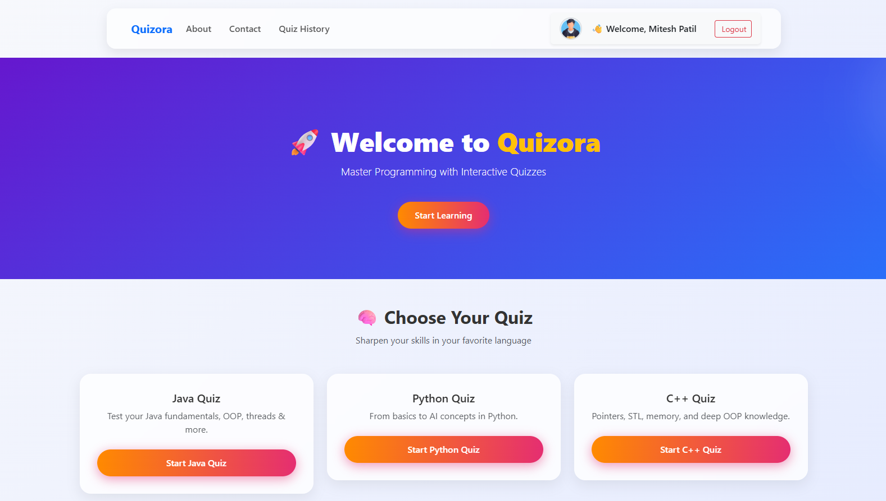

# 📚 Quizora – Smart Online Quiz Platform

**Quizora** is a full-stack web application designed to conduct secure, subject-wise quizzes with real-time scoring and cheating prevention mechanisms. Built using Django and Bootstrap, the platform provides a clean UI and a feature-rich experience for both users and admins.

---

## 🚀 Live Demo

🔗 **Live Preview:**   [Click Here](https://mitesh07.pythonanywhere.com/accounts/login/)

---

## 🛠️ Tech Stack

- **Backend:** Django (Python), Django ORM
- **Frontend:** HTML, CSS, Bootstrap, JavaScript
- **Database:** SQLite (Dev), MySQL (Production Ready)
- **Admin Panel:** Django Admin with Excel import/export support
- **Version Control:** Git & GitHub

---

## ✨ Features

- 🔐 **User Authentication** – Secure registration, login, and session management
- 📚 **Subject-wise Quizzes** – Java, Python, C++, and more
- 📈 **Real-time Scoring** – Instant feedback and scoring after each question
- 🚫 **Cheating Prevention** – Tab-switch detection and camera monitoring
- 📊 **Quiz History Tracking** – View past attempts with timestamps and scores
- 📱 **Responsive UI** – Works seamlessly across all screen sizes
- ⚙️ **Admin Tools** – Add questions via Django Admin or Excel sheet uploads

---

## 📸 Screenshots

> *(You can add screenshots here once available — simply upload them to your repo and link like this)*  

---

📤 Excel Upload for Questions
Prepare your quiz questions in an Excel sheet (format: question_text | option1 | option2 | option3 | option4 | correct_answer)

Use Django Admin or a custom upload form to import them into the database

## 🙋‍♂️ Author

**Mitesh Patil**

📧 Email: [mitesh8767@gmail.com](mailto:mitesh8767@gmail.com)  
🔗 LinkedIn: [Mitesh Patil](https://www.linkedin.com/in/mitpatil07/)

## 📝 License

This project is licensed under the **MIT License** – see the [LICENSE](LICENSE) file for details.